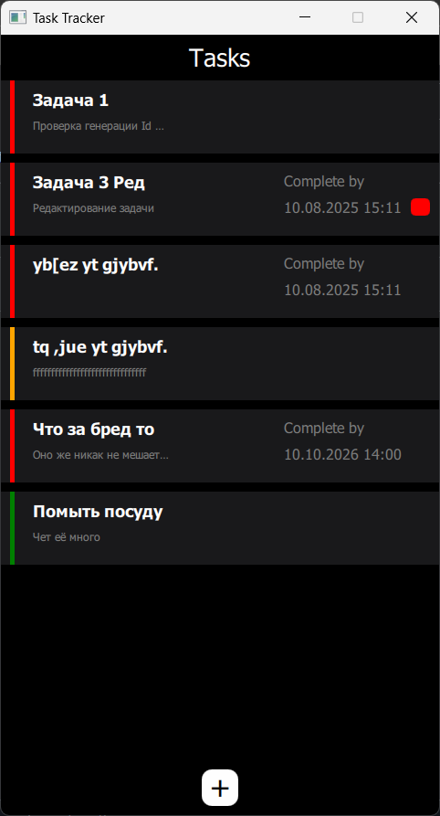
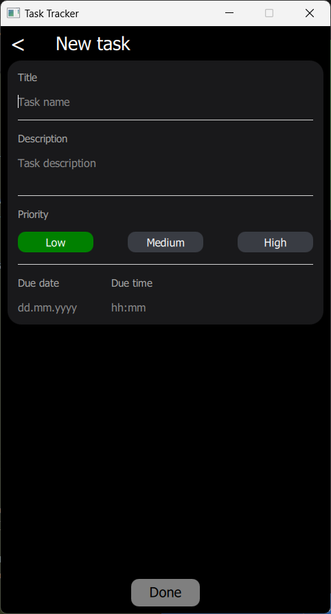
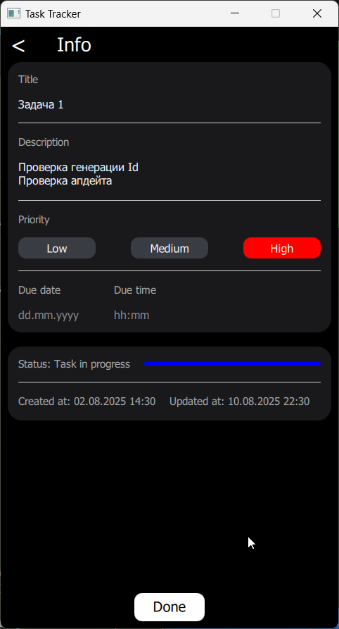
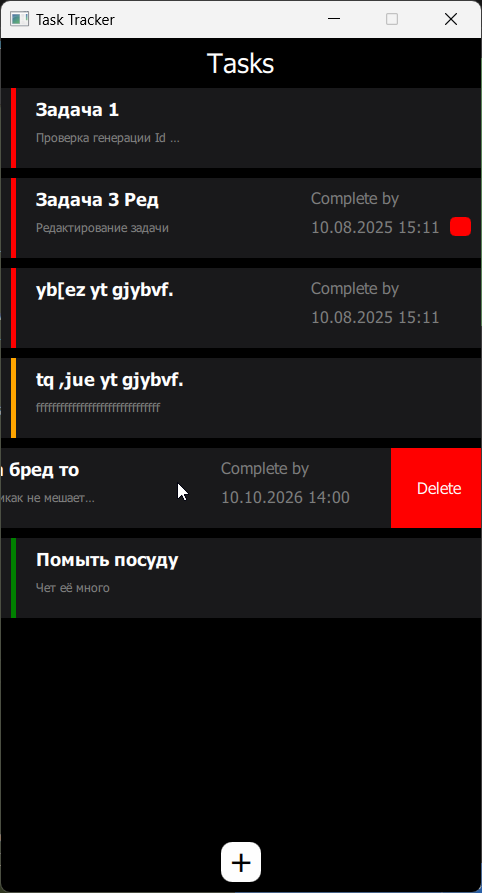

# QMLTaskTracker

Описание
--------

`QMLTaskTracker` — простое кроссплатформенное приложение для управления задачами, реализованное с использованием Qt (C++ / QML). Проект демонстрирует архитектуру, в которой модель данных реализована на C++ (`Task`, `TaskModel`, `TaskRepository`), а интерфейс — на QML (`main.qml`, страницы и делегаты). Приложение поддерживает добавление, редактирование, удаление и сохранение задач в JSON‑файл.

Функциональные возможности
-------------------------

- Создание новой задачи: заголовок, описание, приоритет, дата выполнения.
- Редактирование существующей задачи.
- Удаление задачи (свайп в делегате списка).
- Пометка задачи как выполненной (свайп в делегате).
- Персистентность: задачи сохраняются в JSON-файл (`tasks.json`) в `QStandardPaths::AppDataLocation`.
- Автоматическая загрузка задач при старте и сохранение при выходе.
- Отображение срока выполнения в человекочитаемом формате.

Места для скриншотов
--------------------


[Главный экран]

[Добавление таски]

[Редактирование таски]

[Свайп/удаление]

Логика и взаимодействие с интерфейсом
-----------------------------------

1. Инициализация
	- В `main.cpp` создаются объекты `TaskModel` и `TaskRepository`.
	- `Task` регистрируется как QML-тип: `qmlRegisterType<Task>("TaskTracker", 1, 0, "Task")`.
	- `taskModel` и `repository` передаются в QML контекст через `engine.rootContext()->setContextProperty("taskModel", &taskModel)`.

2. Загрузка данных
	- При старте вызывается `repository.loadTasks(&taskModel)`, который читает JSON, преобразует записи в объекты `Task` и добавляет их в `TaskModel`.

3. Отображение
	- В `main.qml` `ListView` использует `taskModel` как `model`.
	- Делегат `TaskItem.qml` (основан на `SwipeDelegate`) отображает заголовок, описание, приоритет, дату и индикатор статуса.

4. Добавление / Редактирование задач
	- UI: через `InfoTaskPage` (компонент/страница добавления) пользователь вводит `name`, `description`, `priority`, `dueDate`.
	- QML вызывает `taskModel.addTaskFromStrings(...)` для создания новой задачи или `taskModel.updateTask(...)` для редактирования.
	- `TaskModel` обновляет внутренний список и вызывает `saveToRepository()`, который делегирует сохранение `TaskRepository::saveTasks(const TaskModel *)`.

5. Удаление и пометка выполненной
	- Делегат `TaskItem.qml` отслеживает свайпы: свайп вправо — удаление (`taskModel.removeTask(index)`), свайп влево — отметка выполненной (логика на стороне QML сейчас только логирует действие, можно расширить вызовом C++ API).

6. Сохранение при выходе
	- `main.cpp` соединяет сигнал `aboutToQuit` с вызовом `repository.saveTasks(&taskModel)` для финального сохранения.

Ключевые классы и файлы
-----------------------

- `task.h` / `task.cpp` — класс `Task`: свойства задачи (id, name, description, dueDate, isCompleted, priority, createdAt, updatedAt). Определяет методы валидации и утилиты (`isValid()`, `isOverdue()`, `toString()`).
- `TaskModel.h` / `TaskModel.cpp` — наследник `QAbstractListModel`, хранит `QList<Task*>`, предоставляет роли для QML и Q_INVOKABLE методы: `addTask`, `removeTask`, `updateTask`, `addTaskFromStrings`, `saveToRepository`, `loadFromRepository`.
- `TaskRepository.h` / `TaskRepository.cpp` — сериализация/десериализация задач в JSON. Файл по умолчанию — `tasks.json` в `AppDataLocation`.
- `main.qml` — точка входа QML: `ListView` задач, навигация страниц.
- `TaskItem.qml` — делегат со свайпами и отображением данных.
- `InfoTaskPage.qml` / `AddTaskPage.qml` — страницы для создания и редактирования задач.
- `qml.qrc` — ресурсы (QML и шрифты).

Структура проекта (корень `TaskTracker`)
--------------------------------------

- `main.cpp` — запуск приложения, регистрация типов, передача контекстных свойств.
- `task.h`, `task.cpp` — модель задачи.
- `TaskModel.h`, `TaskModel.cpp` — модель списка для QML.
- `TaskRepository.h`, `TaskRepository.cpp` — чтение/запись JSON.
- `main.qml`, `*.qml` — интерфейс и компоненты.
- `qml.qrc` — ресурсы.

Сборка и запуск
---------------

Проект использует Qt (примерно Qt 5.15 в настройках). Обычные шаги сборки из командной строки (Windows + MinGW/Qt):

```powershell
cd "d:\c++ everything\learning qml\QMLTaskTracker\TaskTracker"
qmake
mingw32-make
.
```

Или откройте `TaskTracker.pro` в Qt Creator и собирайте/запускайте оттуда.

Примечания по реализации и возможные улучшения
----------------------------------------------

- Копирование `QObject` (в классе `Task`) и использование копирующего конструктора может приводить к неожиданным проблемам. Рекомендуется:
  - либо сделать `Task` простой структурой данных (без `QObject`),
  - либо убрать копирующий конструктор и реализовать явное создание объектов и копирование полей.
- Сделать сохранение атомарным: записывать во временный файл и затем переименовывать, чтобы избежать повреждения данных при сбое.
- Добавить подтверждение удаления и возможность отката (undo) после удаления.
- Обработка временных зон при парсинге/форматировании дат.
- Добавить unit-тесты для `TaskRepository` (сериализация/десериализация) и для `TaskModel`.

Идеи для функционального расширения
----------------------------------

- Фильтрация и сортировка задач (по приоритету, статусу, дате).
- Повторяющиеся задачи (recurrence).
- Синхронизация с облачным хранилищем или календарём.
- Уведомления о просроченных задачах.

